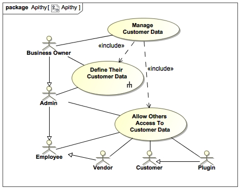
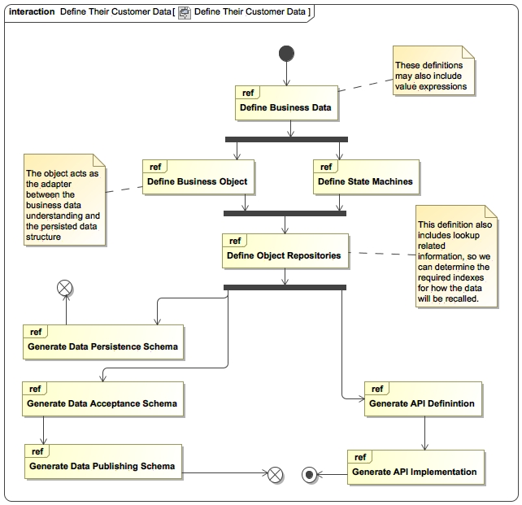

# Apithy

Data within the context of distributed eventually consistent systems is solved. I'm really just kinda tired of dealing with it. We do this over and over and over. It's not fun any more.

Let's be honest. Saving and recalling data over the internet: not REALLY an interesting problem, in and of itself.

Given this, I figured Apithy was as good a name as any.

Scope of concern? This has come out of building several distributed software as a service platforms. The use cases I am considering scale from "single dev working on hobby app" to "SaaS architect picking a data layer for their SOA design, requiring differing access levels for admins, engineers, employees, customers, vendors, and plugins"

I personally aim to build a few businesses on top of this. As much of what can be abstracted will be. Record ownership, OAuth authentication, AWS cloud formation templates (or whatever is used). 

The goal is to be able to define your Business Objects (which include structure and state machines), collect them into Repositories, and then automatically generate db schema, api schema, api implementation, api client, api tests, and admin system.

The only thing that gets hinky is custom validations running before persistance, but we can look at the Doctrine and Rails style ORMs to pull some easy patterns there, but if you follow the rule that "anything that is uncertain is done while the customer UI still has flow control" you will find that the number of instances where you require custom validators drops significantly.

You can define objects quite well. Let's imagine a simple Todo App.

`Task.object.yaml`
```
singular: Task
plural: Tasks
behaviors:
  timestamped: ~ # by default everything gets created_at, updated_at
  softdelete: ~ # by default should be enabled
structure: # Using a name other 'properties' because I'm super-setting JSON Schema
  title:
    type: string # string means specifically a single conceptual line of text
    required: true
  description:
    type: text # text means specifically a block of text, more than "string"
  state:
    type: enum
    enum:
      - todo
      - done
    default: todo
  is_completed:
    type: expression # could also be cached-expression but that would be redundant since this does not aggregate
    expression: state == "done" # we'll constrain to a simpler domain of equations for portability
                                # but in reality this will just pass through to the API implementation for now.
events:
  complete:
    from_state: todo
    to_state: complete
  uncomplete:
    from_state: complete
    to_state: todo
```

We could then envision the Repository definition for this object in `todolist.repository.yaml`:
```
object_paths:
 - ../objects/
objects:
  task: ~ # leave the specific path able to be defined to override auto-location finding, or to enable renaming for sanity
repository:
  task:
    orderBy: title
```

The inferred config would end up looking something like:
```
object_paths:
 - ../objects/
objects:
  task: ~ # leave the specific path able to be defined to override auto-location finding, or to enable renaming for sanity
repository:
  task:
    indexes:
      id: ~
      state:
        include:
          - title
```

From this, we know we need a data store named task, and that we will look it up by id, or by state, ordered by title.

The api would look like:

getTask(id) - Task
getTasks(state) - [Task]
completeTask(id) - Boolean
uncompleteTask(id) - Boolean

The REST or GraphQL api implementations, I'll leave to your imagination.

We also have enough information to generate a basic admin system for this data.

Some WIP diagrams explaining this in another way:




